<!-- _class: lead -->

# All-in-Focus Reconstruction<br>via Focal Stack Fusion

**Computational Imaging Mini Project**

Engin Samet Dede

---

# The Problem: Shallow Depth of Field

<div class="columns">
<div>

- Macro / close-up lenses have **very shallow DoF**
- A single frame keeps only **one depth plane** sharp
- Different frames in a burst are sharp in **different regions**
- Goal: merge all frames into **one fully-sharp image**

<div class="callout">
Motivating case: macro insect photography — no single shot captures the whole subject in focus.
</div>

</div>
<div>

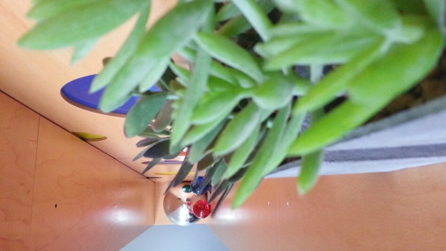

</div>
</div>

---

# What is a Focal Stack?

<div class="columns">
<div>

- Capture **N images** at slightly different focus distances
- Subject stays fixed; only **focus distance changes**
- Handheld stacks need **spatial alignment** before fusion
- Each frame contributes its sharpest region to the final image

</div>
<div>

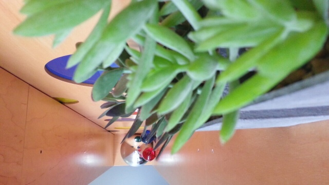

</div>
</div>

---

# Pipeline Overview

<div class="pipeline">
📷 &nbsp;<span>Focal Stack</span><br>
&nbsp;&nbsp;&nbsp;&nbsp;&nbsp;↓<br>
🔧 &nbsp;<span>ECC Alignment</span>&nbsp;&nbsp; ← correct handheld shift<br>
&nbsp;&nbsp;&nbsp;&nbsp;&nbsp;↓<br>
📊 &nbsp;<span>Focus Scoring</span>&nbsp;&nbsp;&nbsp; ← per-pixel sharpness map<br>
&nbsp;&nbsp;&nbsp;&nbsp;&nbsp;↓<br>
🗺️ &nbsp;<span>Focus Map</span>&nbsp;&nbsp;&nbsp;&nbsp;&nbsp;&nbsp;&nbsp; ← which frame wins each pixel?<br>
&nbsp;&nbsp;&nbsp;&nbsp;&nbsp;↓<br>
🔀 &nbsp;<span>Fusion</span>&nbsp;&nbsp;&nbsp;&nbsp;&nbsp;&nbsp;&nbsp;&nbsp;&nbsp;&nbsp;&nbsp; ← WTA / Soft / Pyramid<br>
&nbsp;&nbsp;&nbsp;&nbsp;&nbsp;↓<br>
✅ &nbsp;<span>All-in-Focus Image</span>
</div>

<div class="callout" style="margin-top:0.8rem">
Each stage is applied consistently across all datasets.
</div>

---

# Pipeline Step: ECC Alignment

<div class="columns">
<div>

<div class="card">

**Why alignment?**
- Handheld capture → **3–8px shift** between frames
- ECC corrects translation before any scoring
- Without it: blurry artifacts at frame boundaries

</div>

<div class="callout">
Skipped for pre-registered datasets (Lytro pairs already aligned)
</div>

</div>
<div>

```python
warp = np.eye(2, 3, dtype=np.float32)

cv2.findTransformECC(
    ref_gray, frame_gray,
    warp, cv2.MOTION_TRANSLATION
)

aligned = cv2.warpAffine(
    frame, warp, (w, h),
    flags=cv2.WARP_INVERSE_MAP
)
```

</div>
</div>

---

# Focus Measures (1/2): Laplacian & Tenengrad

<div class="columns">
<div>

<div class="card">

### Laplacian Variance
Detects edges via second-order derivative. Sensitive to noise but fast.

```python
raw = cv2.Laplacian(
    gray, cv2.CV_32F
) ** 2
score = cv2.blur(raw, (17, 17))
```

</div>

</div>
<div>

<div class="card">

### Tenengrad <span class="highlight">✓ Selected</span>
Gradient magnitude via Sobel. Robust, fast, noise-tolerant.

```python
gx = cv2.Sobel(gray, cv2.CV_32F, 1, 0)
gy = cv2.Sobel(gray, cv2.CV_32F, 0, 1)
score = cv2.blur(
    gx**2 + gy**2, (17, 17)
)
```

</div>

</div>
</div>

---

# Focus Measures (2/2): Local Contrast & SML

<div class="columns">
<div>

<div class="card">

### Local Contrast
Variance within a local neighborhood. Good at texture regions.

```python
mean = cv2.blur(gray, (17, 17))
score = cv2.blur(
    (gray - mean) ** 2, (17, 17)
)
```

</div>

</div>
<div>

<div class="card">

### SML — Sum of Modified Laplacian
Fine texture detail, border-aware. Best for very fine structures.

```python
ml_x = abs(2*g - roll(g,+s,axis=1)
             - roll(g,-s,axis=1))
ml_y = abs(2*g - roll(g,+s,axis=0)
             - roll(g,-s,axis=0))
score = local_mean(ml_x + ml_y)
```

</div>

</div>
</div>

---

# Method Selection: Why Tenengrad?

<div class="columns">
<div>

| Method | Plants | Lytro Avg | Rank |
|---|---|---|---|
| **Tenengrad** | **1st ✓** | **1st ✓** | 🥇 |
| Laplacian | 2nd | 2nd | 🥈 |
| Local Contrast | 3rd | 3rd | 🥉 |
| SML | 4th | 4th | 4th |

<div class="callout">
Ranking confirmed on 3 independent Lytro pairs — consistent across datasets validates the choice.
</div>

</div>
<div>

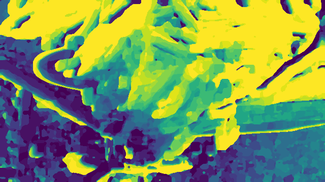

*Focus map — plants baseline, Tenengrad*

</div>
</div>

---

# Fusion Method 1: Winner-Takes-All

<div class="columns">
<div>

<div class="card">

**Strategy:** pick the frame with the highest focus score per pixel

- Fastest method — one `argmax` operation
- Sharp edges
- Can show **visible seams** at depth transitions

</div>

```python
focus_map = np.argmax(scores, axis=0)

fused[r, c] = stack[
    focus_map[r, c], r, c
]
```

</div>
<div>

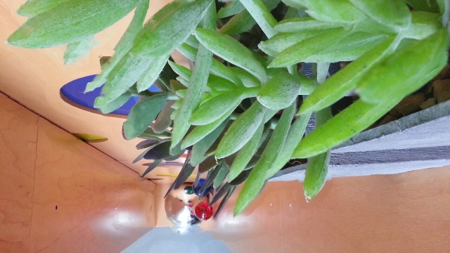

*Plants dataset — WTA result*

</div>
</div>

---

# Fusion Method 2: Soft Fusion

<div class="columns">
<div>

<div class="card">

**Strategy:** weight all frames by normalized sharpness score (softmax)

- Smooth transitions — avoids hard seams
- Slightly softer than WTA at high-contrast edges

</div>

```python
weights = softmax(
    beta * scores, axis=0
)
fused = np.einsum(
    "fhwc,fhw->hwc",
    stack, weights
)
```

</div>
<div>

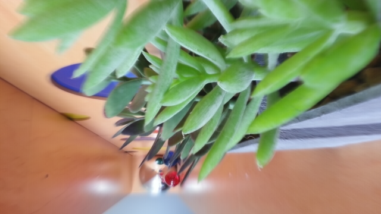

*Plants dataset — Soft fusion result*

</div>
</div>

---

# Fusion Method 3: Laplacian Pyramid

<div class="columns">
<div>

<div class="card">

**Strategy:** multi-scale frequency decomposition + per-band blending

- Blend each **frequency band** separately
- Recombine bands → final image
- **Best perceptual quality**
- Highest computational cost

</div>

```python
# Per pyramid level:
blended[lvl] += (
    laplacian_pyr[lvl]
    * gauss_weight_pyr[lvl]
)
# Collapse pyramid to reconstruct
```

</div>
<div>

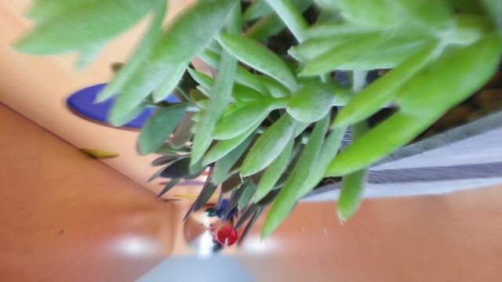

*Plants dataset — Pyramid result*

</div>
</div>

---

# Datasets Overview

<div class="columns">
<div>

<div class="card">

**🌿 Plants** — Reference
6 frames · standard benchmark
Used for method selection & validation

</div>

<div class="card" style="margin-top:0.7rem">

**🌸 Flower Macro Stack**
6 ProRAW frames
5712×4284 → 1920px · f/1.78 

</div>

</div>
<div>

<div class="card">

**📷 Personal Handheld Stack**
6 frames · handheld
ECC alignment critical

</div>

<div class="card" style="margin-top:0.7rem">

**🐛 Insect Stack**
2 frames · insect moved mid-shoot!
32% / 68% frame split — both frames contribute meaningfully

</div>

</div>
</div>

---

# Focus Maps: Per-Pixel Frame Selection

<div class="columns">
<div>

- Colormap shows **which frame is sharpest** at each pixel
- Smooth gradient = consistent focus shift across stack
- Insect: **clear binary split** between two frames

<div class="callout">
Insect stack: frame 0 → 32% | frame 1 → 68%<br>
Sharpness improved: <strong>0.52 → 0.68</strong>
</div>

</div>
<div>

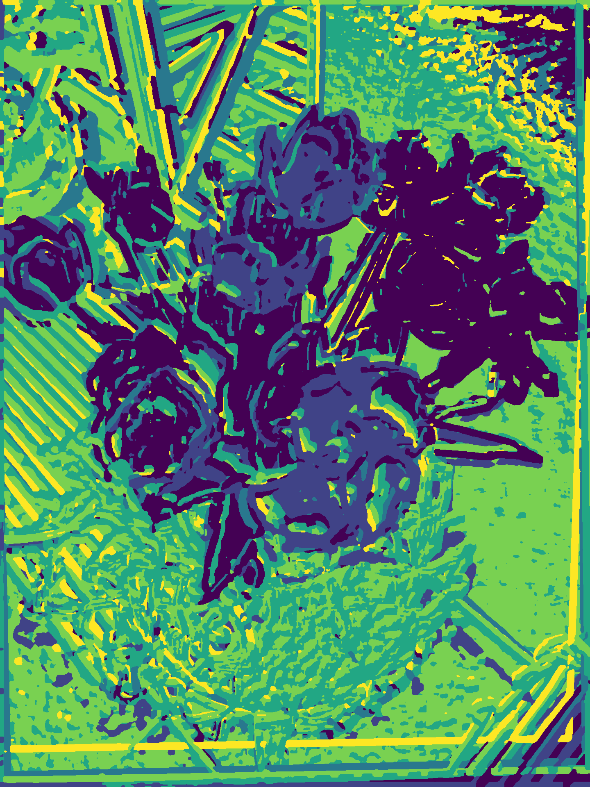
*Flower — 6-frame focus map*

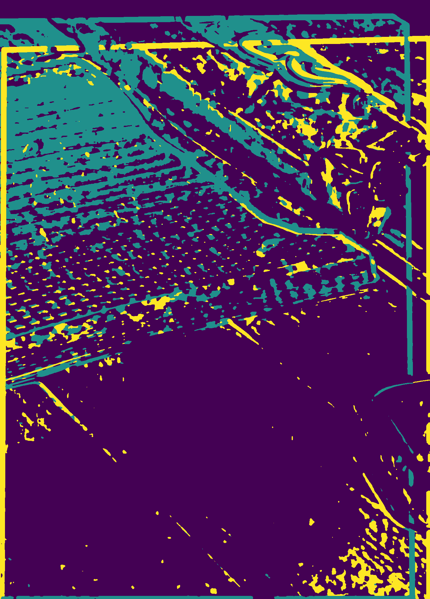
*Insect — 2-frame focus map*

</div>
</div>

---

# Results: Flower Stack

<div class="columns3">

<div>

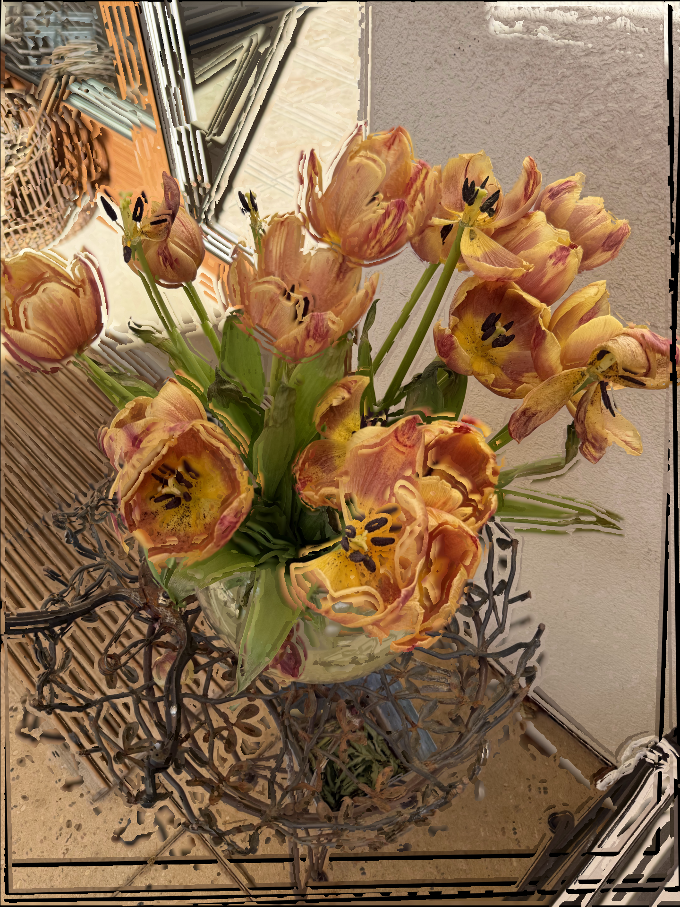

**Winner-Takes-All**

</div>
<div>

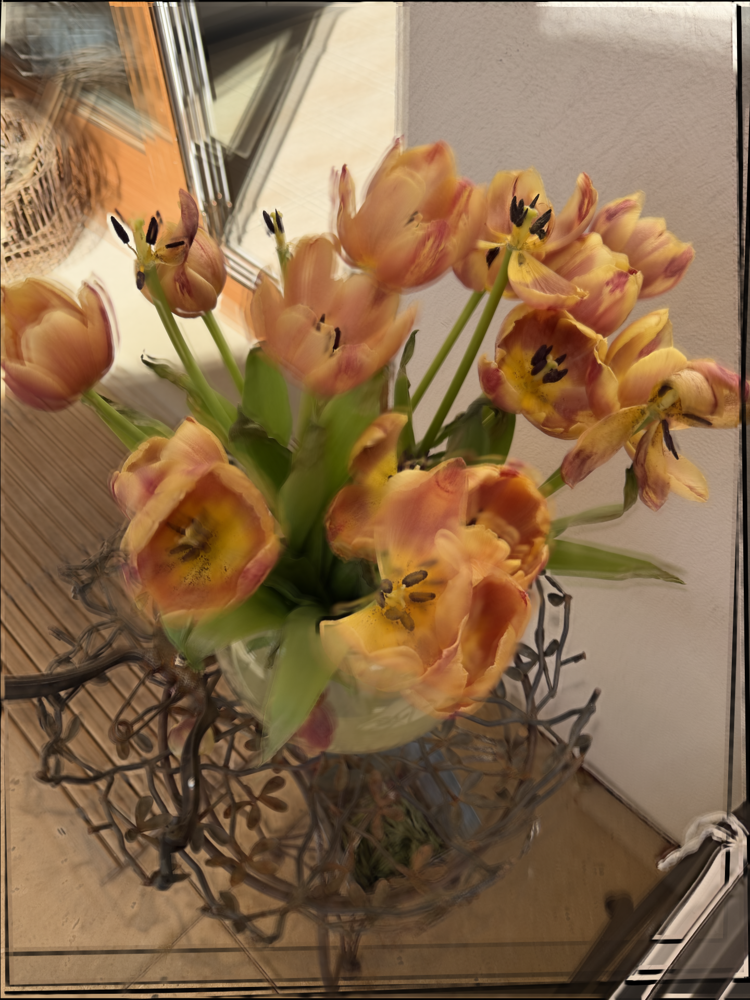

**Soft Fusion**

</div>
<div>

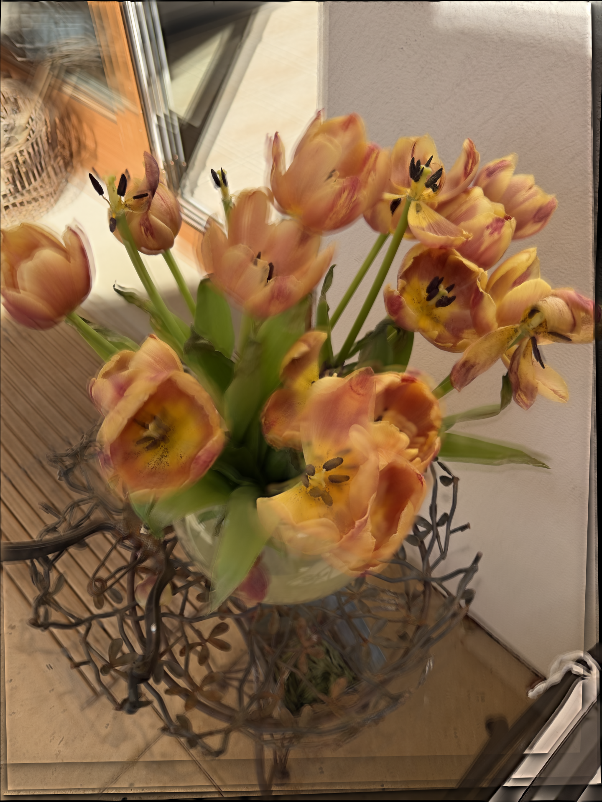

**Pyramid Blending**

</div>
</div>

<div class="callout" style="margin-top:0.8rem">
Pyramid blending produces the most natural color transitions. ECC alignment corrected ~3–8px shift between handheld frames.
</div>

---

# Results: Insect Stack

<div class="columns">
<div>

- Insect moved between shots — alignment challenge
- Despite only **2 frames**, fusion clearly improves sharpness
- Sharpness: **0.52 → 0.68** (pyramid fused)
- SSIM and entropy both improve with pyramid blending

<div class="callout">
+31% sharpness improvement with just 2 frames
</div>

</div>
<div>

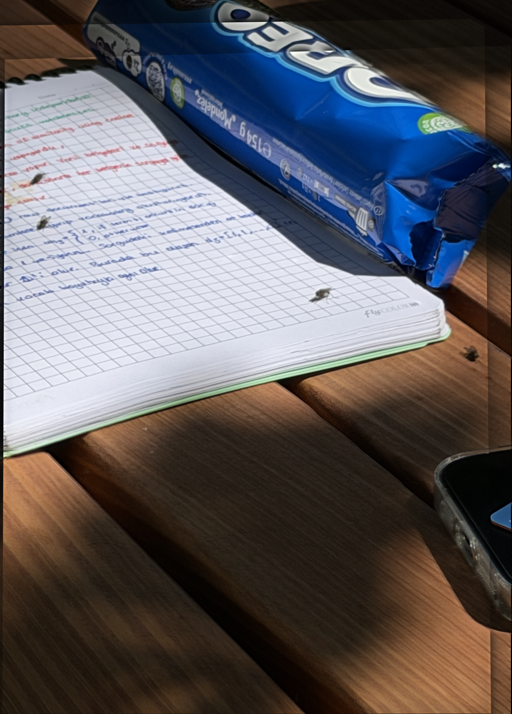

*Insect — Pyramid blending result*

</div>
</div>

---

# Quantitative Evaluation

| Method | Tenengrad | SSIM | Entropy |
|---|---|---|---|
| Single frame (sharpest) | baseline | 1.00 | baseline |
| Winner-Takes-All | ↑↑ | ↓ slight | ↑ |
| Soft Fusion | ↑ | ↑ | ↑ |
| **Pyramid Blending** | **↑↑** | **↑↑** | **↑↑** |

Tested across: **Plants · Flower · Insect · Lytro-03 · Lytro-11 · Lytro-13**

<div class="callout">
Pyramid blending wins on all three metrics across all datasets.
</div>

---

# Conclusion

<div class="columns">
<div>

✅ Focal stack fusion produces all-in-focus images across **all tested datasets**

✅ **Tenengrad**: best sharpness / speed tradeoff among four focus measures

✅ **Laplacian pyramid**: best perceptual quality

✅ **ECC alignment** handles handheld capture reliably

✅ Method generalizes: plants, flowers, insects, Lytro benchmark

✅ Works with just **2 frames** (insect result)

</div>
<div>


</div>
</div>

---

# Future Work & References

<div class="columns">
<div>

<div class="card">

**Future Work**

→ Neural / learned focus scorer *(MLP extension prototyped)*

→ Real-time pipeline for video focal stacks

→ Ultra-wide lens dataset *(2.22mm f/2.2)*

→ Evening / low-light stack evaluation

</div>
,
</div>
<div>

<div class="card">

**References**

- Nayar, *Depth from Defocus*
- Suwajanakorn et al., CVPR 2015
- Nejati et al., Information Fusion 2015
- Araujo et al., arXiv 2023
- Xie et al., Applied Intelligence 2025

</div>

</div>
</div>

---

<!-- _class: thankyou -->

# Thank You

<div class="ty-divider"></div>
<div class="ty-name">Engin Samet Dede</div>
<div class="ty-sub">Computational Imaging Mini Project</div>
<div class="ty-questions">Questions?</div>
